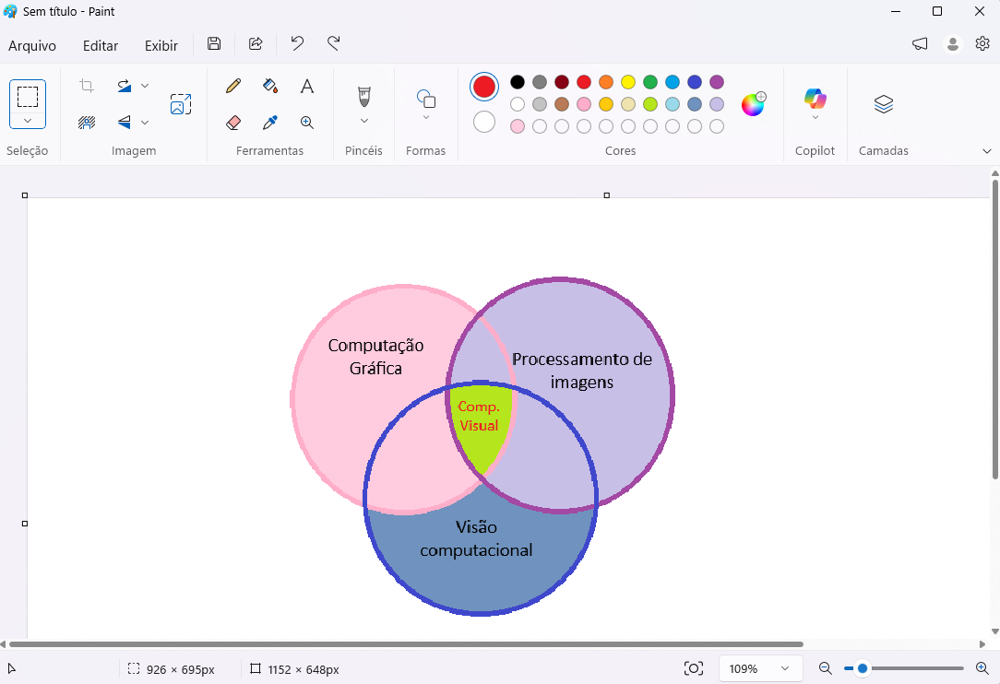

### 🌸 Atividade 1: Computação Visual?

Oiê! Para responder a seguinte pergunta feita pelo professor:
**“O que você acha que verá na disciplina? Isto é, qual é a sua ideia de Computação Visual?”**

Primeiro é necessário destacar minhas experiencias prévias no curso, com uma matéria que eu achava que teria algo de front-end, mas na verdade teve pouquissima relação, então, não espero muito e não procuro pensar muito sobre nenhuma matéria antes de começar. 
Portanto, apenas pensando no nome "Computação Visual", me remete a calculos, 010101, formulas, códigos e outros relacionados a computação. Imaginava algo como: "o que está por trás das imagens/do visual mostrado em nossas telas?"
Entender o que é pixel talvez? Não fui muito além, nem pensei muito.

Então: 010101, calculos, formulas, algoritmos + imagens, visual, visualização = formação das imagens/ coisas que vemos no ambiente virtual?, computação visual?

E para a: 
** O que você entendeu que estudaremos?

Após as primeiras aulas e ao ler o plano de ensino... eu meio que acertei? 

Tipo, a gente já começou a ver e entender como as imagens são formadas e representadas na primeira aula, veremos os altgoritmos responsaveis pelo processamento das imagens e mexeremos com esses algoritmos (o básico eu acho).
E na aula, o professor também definiu o escopo da disciplina para algo que entre as areas de computação gráfica, processamento de imagens e visão computacional.

É possivel entender melhor, observando o diagrama abaixo que foi altamente inspirado nos dos blogs de meus amigos Bruna e Henrique.

Ao dar uma olhada melhor nessas áreas, percebi que eu meio que arrasei no meu palpite 😘

Estou realmente interessada em descobrir mais sobre o que vemos 👀.  

