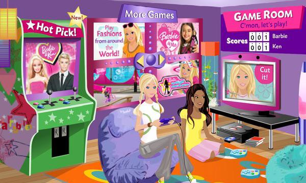
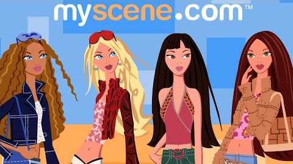
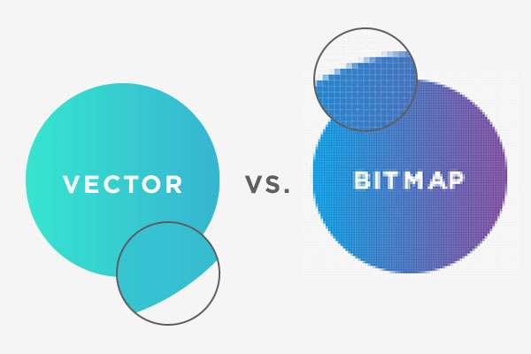
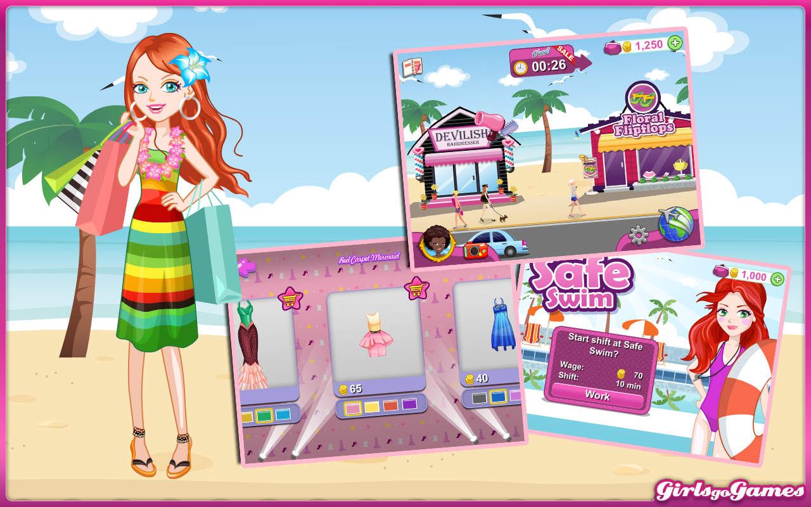

### 🌸 Atividade 2: Como a Arte Vetorial Dominou os Anos 2000

Oii meninas! Como já devem ter notado, este blog é altamente inspirado na internet dos anos 1990-2010 para as meninas, os blogs de maquiagem, foruns e espaços virtuais, confesso que não tive muito contato, mas sempre vi as garotas legais e mais velhas navegando nessas páginas.

Então, minha ideia inicial era na verdade fazer um site como os da Barbie, Polly, Myscene e o GirlsGoGames, minha infância e contato com a técnologia.

O que me impediu, além da falta de abas e conteúdos para embelezar o site, foi ter descoberto que as artes dos sites:

São artes vetoriais, algo que nunca fiz mesmo tendo experiencia com arte digital. Algo sobre a "falta" de controle em cada traço ou pixel e ter que trabalhar com formas geométicas me estressa muito.

Porém, na ultima aula de Computação Visual, realizada dia 20/08, descobri através do professor que no universo 2D existem dois tipos de imagem, as matriciais(raster ou bitmap) e as vetoriais.

As *imagens matriciais* são compostas por uma matriz pixels, onde cada pixel armazena as informações sobre uma cor. E considerando a infinidade de cores existentes, com uma matriz grande o suficiente podemos ter a foto mais realista e detalhada possível, mas a matriz também seria enorme e pesada.

Já as *imagens vetoriais* são criadas a partir de fórmulas matemáticas e processadas pelo computador, para calcular as linhas curvas e outras formas.
As imagens vetoriais são mais leves por serem mais simples e por armazenarem apenas as formulas. E também podem se ajustar a qualquer tamanho sem ficarem feias:
Como por exemplo ao desenhar um círculo essa é a fórmula que está por trás dele: (x - h)^2 + (y - k)^2 = r^2 onde se o tamanho da imagem mudar, os valores das variáveis mudam e o valor final, o tamanho do círculo, se ajusta.

De: https://www.presentationteam.com/bitmap-and-vector-graphics-in-presentations/

Mas mesmo com a arte sendo vetorial, o seu monitor responsável por apresentá-la a você, trabalha com píxels, portanto, é necessária uma tradução, chamada de rasterização, feita através dos softwares em conjunto com o hardware da máquina(CPU ou GPU). E na época, a maioria dessas imagens eram feitas no Macromedia Flash, trabalhando em conjunto com o software flash player para tradução.

Dentre os jogos feitos na época, chamados de "flash games" pela utilização de artes vetoriais feitas no programa popular da época, o Macromedia Flash, estão o Club Penqguin e o Shopaholic(meu favorito).

Mas por que esse estilo era tão utilizado? 

Bom, tudo isso era na época da internet discada, ou na época do finado 3g, onde baixar imagens matriciais com milhares de pixels pesados demorava muito.
E as Barbies precisavam trocar de looks rapidamente!
As fórmulas matemáticas (vetores) ocupam pouquíssimo espaço de armazenamento, permitindo que jogos complexos carregassem super rápido nos navegadores!

Hoje em dia, mesmo na época chata do minimalismo, e com uma internet raípidíssima ainda utilizamos imagens vetoriais para fazer logos e ícones, que podem ser redimensionados sem perder a qualidade.

