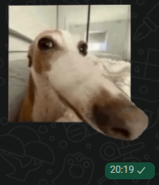
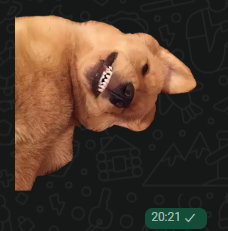

### 🌸 Atividade 5: O Segredo das Figurinhas do WPP e a Matemática das Bordas!

Oii meninas!

Hoje vamos falar sobre um truque que a gente usa o tempo todo: sabe quando seguramos o dedo em uma foto na galeria do celular e ele magicamente recorta a gente do fundo para fazer uma figurinha do WPP? 

Parece mágica, mas a nossa aula de Computação Visual explica que isso é pura matemática! - de novo...🙄

Para o seu celular conseguir recortar perfeitamente, ele precisa encontrar os contornos do objeto. Na matéria, aprendemos que o objetivo da detecção de bordas é justamente identificar mudanças bruscas (descontinuidades) em uma imagem. A lógica é super simples:
* Os pixels tendem a ser como seus vizinhos, possuindo valores próximos entre si.
* Quando os pixels são muito diferentes dos seus vizinhos, as representações digitais dessa imagem, assim como um gráfico, mostramessas mudanças bruscas.
* Essa mudança brusca, que pode ser uma descontinuidade na cor da superfície ou na iluminação, indica que ali existe uma borda.

Para encontrar essas linhas exatas (tentando imitar o desenho das linhas que nós seres humandos enxergamos como delimitadoras), o computador calcula essas mudanças nos níveis de cinza usando derivadas parciais. O método mais completo e *it girl* que estudamos para isso é o **Detector de bordas de Canny**. Olha só o que o *pipeline* faz nos bastidores antes de cuspir a sua *fig*:

* **Tirando as impurezas:** Como imagens com ruído, como de samsungs também têm gradientes grandes, o algoritmo primeiro filtra a imagem (usando derivadas da Gaussiana) para suprimir esse ruído e evitar a criação de bordas falsas.
* **Achando o contorno:** Ele encontra a magnitude e a orientação do gradiente. A derivada primeira ajuda a localizar as bordas: ela fica positiva quando passa de uma região escura para clara, e negativa do claro para o escuro.
* **Afinando a silhueta:** Para o contorno do seu recorte não ficar borrado, ocorre a "supressão de não-máximos". O sistema compara a magnitude do pixel com os vizinhos e suprime (zera) quem não for o "pico" da crista da borda, o que reduz a espessura do traço.
* **Ligando os pontinhos:** Por fim, rola a limiarização por histerese. Ele usa um limiar alto (para bordas fortes) e um baixo (para bordas fracas), conectando os pontos certinhos para fechar o desenho do seu recorte.

Beijinhos e até a próxima anotação! *ੈ✩‧₊˚